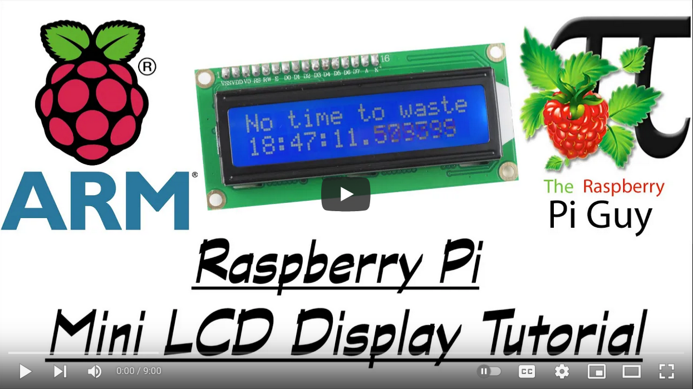
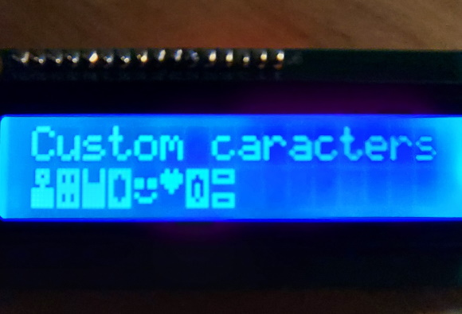
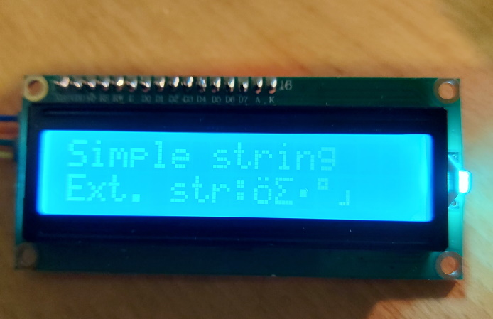
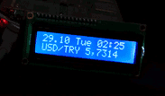
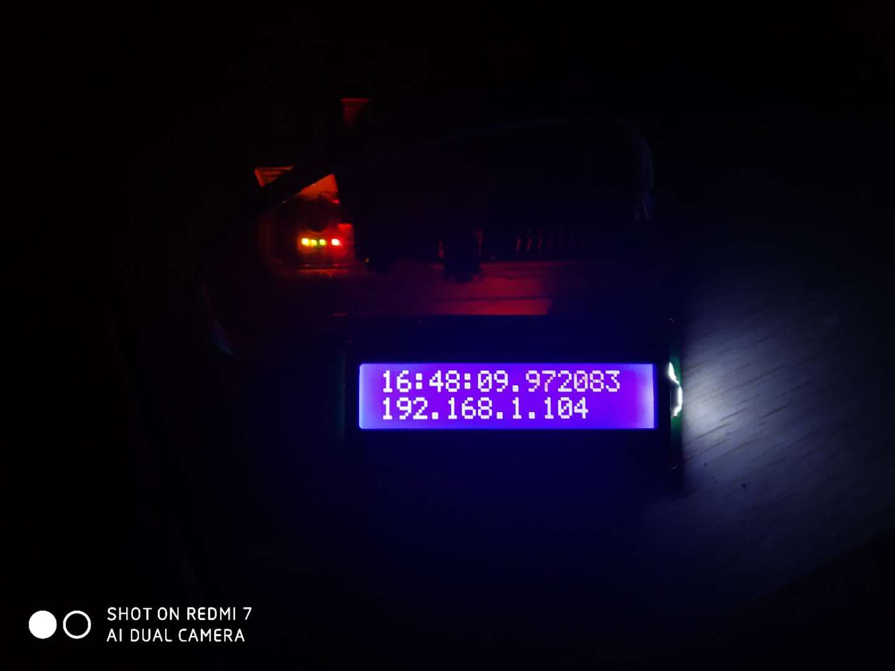
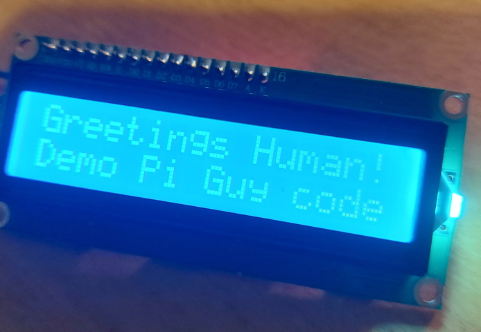
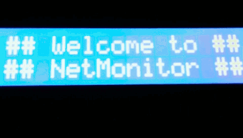
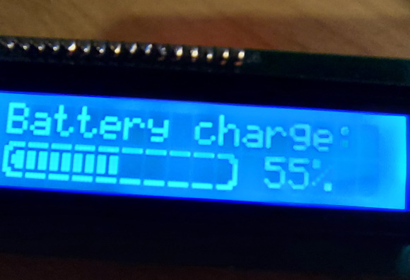

# LCD
This repository contains all the code for interfacing with a **16x2 character I2C liquid-crystal display (LCD)**. This accompanies my **Youtube tutorial**: [Raspberry Pi - Mini LCD Display Tutorial](https://www.youtube.com/watch?v=fR5XhHYzUK0).

<p align="center">
  <a href="https://www.youtube.com/watch?v=fR5XhHYzUK0">
    
  </a>
</p>

You can buy one of these great little I2C LCD on eBay or somewhere like [the Pi Hut](https://thepihut.com/search?type=product&q=lcd).

# Table of Contents
1. [Installation](#Installation)
2. [Demos](#demos)
   - [Backlight control](#backlight-control)
   - [Custom characters](#custom-characters)
   - [Extended strings](#extended-strings)
   - [Forex](#forex)
   - [IP address](#ip-address)
   - [LCD](#lcd-1)
   - [NetMonitor](#netmonitor)
   - [Progress bar](#progress-bar)
   - [Tiny Dashboard](#tiny-dashboard)
3. [Implementation](#Implementation)
   - [Systemd](#systemd)
4. [Contributions](#contributions)

# Installation
- Install git
  ```
  sudo apt install git
  ```

- Clone the repo in your home directory
  ```
  cd /home/${USER}/
  git clone https://github.com/the-raspberry-pi-guy/lcd.git
  cd lcd/
  ```

- Run the automatic installation script with `sudo` permission
  ```
  sudo ./install.sh
  ```

- During the installation, pay attention to any messages about `python` and `python3` usage, as they inform which version you should use to interface with the LCD driver.  For example:
  ```
  [LCD] [INFO] You may use either 'python' or 'python3' to interface with the lcd.
  ```
  or alternatively,
  ```
  [LCD] [INFO] Use 'python3' to interface with the lcd.
  ```

- At the end of the installation script, you'll be prompted to reboot the RPi to apply the changes made to `/boot/config.txt` and `/etc/modules`.

- After rebooting, try one of the [**demos**](#demos):
  ```
  ./home/${USER}/lcd/demo_clock.py
  ```
  or
  ```
  python /home/${USER}/lcd/demo_clock.py
  ```
  or
  ```
  python3 /home/${USER}/lcd/demo_clock.py
  ```

[top :arrow_up:](#)

# Demos
A list of demonstration (demo) files that illustrate how to use the LCD driver.  Demos are ordered alphabetically.

## Backlight Control
- Author: [@Tomtom0201](https://github.com/Tomtom0201)

This demo showcases the backlight control of the LCD, which is available on some hardware:

<p align="center">
  
</p>

## Custom characters
- Author: [@juvus](https://github.com/juvus)

It is possible to define in CG RAM memory up to 8 custom characters. These characters can be prompted on LCD the same way as any characters from the [characters table](imgs/characters_table.png). Codes for the custom characters are unique and as follows:

  1. `{0x00}`
  2. `{0x01}`
  3. `{0x02}`
  4. `{0x03}`
  5. `{0x04}`
  6. `{0x05}`
  7. `{0x06}`
  8. `{0x07}`

Please, see the comments and implementation in the [`demo_lcd_custom_characters.py`](demo_lcd_custom_characters.py) file for more details on how to use custom characters.

<p align="center">
  
</p>

## Extended strings
- Author: [@juvus](https://github.com/juvus)

This is demo showcases how extended strings could be used. Extended strings can contain special placeholders of form `{0xFF}`, that is, a hex code of the symbol wrapped within curly brackets. Hex codes of various symbols can be found in the following characters table:

<p align="center">
  
</p>

For example, the hex code of the symbol `ö` is `0xEF`, and so this symbol could be printed on the second row of the display by using the `{0xEF}` placeholder, as follows:

```Python
display.lcd_display_extended_string("{0xEF}", 2)
```

If you want to combine placeholder to write a symbol `{0xFF}` with the native Python placeholder `{0}` for inserting dome data into text, escape the non-native placeholders. Here is an example:

```Python
display.lcd_display_extended_string("Symbol:{{0xEF}} data:{0}".format(5), 2)
```

<p align="center">
  
</p>

## Forex
- Author: [@bariskisir](https://github.com/bariskisir)
- Additional Python package requirements: `pip`, `requests`, `bs4`

To install the requirements, follow this procedure:
  - Install `pip` and use it to install the remaining packages
    ```sh
    sudo apt install python-pip
    pip install requests bs4
    ```

<p align="center">
  
</p>

## IP Address
- Author: [@Sierra007117](https://github.com/Sierra007117)

Display your Pi's IP address, which is useful for `SSH` access and more!

<p align="center">
  
</p>

## LCD
- Author: [@Tomtom0201](https://github.com/Tomtom0201)

This demo shows how simple strings could be displayed on the LCD.  For extended usage, take a look at [Extended strings](#extended-strings) demo instead.

<p align="center">
  
</p>

## NetMonitor
- Author: [@cgomesu](https://github.com/cgomesu)

This demo uses `ping` and `nc` (netcat) to monitor the network status of hosts and services, respectively. Hosts and services can be modified by editing their respective [dictionaries](https://docs.python.org/3/tutorial/datastructures.html#dictionaries):

```Python
hosts = {
    'Internet': '8.8.8.8',
    'Firewall': '192.168.1.1',
    'NAS': '192.168.1.2'
}
services = {
    'Cameras': {'ip': '192.168.1.2', 'port': '8000'},
    'Plex': {'ip': '192.168.1.2', 'port': '32400'}
}
```

<p align="center">
  
</p>

## Progress bar
- Author: [@juvus](https://github.com/juvus)

This is a demo of a graphical progress bar created with [custom characters](#custom-characters). This bar could be used, for example, for showing the current level of battery charge.

<p align="center">
  
</p>

## Tiny dashboard
- Author: [@jdarias](https://github.com/jdarias)

This is a script that shows a famous quote, a currency conversion pair of your choice and the weather of a city. It also shows the last three characters from your ip address, the date in DDMM format and the hour in HH:MM format

<p align="center">
  
</p>

The script takes info from the following APIs:

* [theysaidso.com](https://theysaidso.com): Free public API that provides famous quotes from well known people. It has a public endpoint that doesn't require an API key.

* [exchangerate-api.com](https://exchangerate-api.com) / [free.currencyconverterapi.com](https://free.currencyconverterapi.com): There are a lot of currency apis but these ones offer free currency exchange info. Both are used, one as main, the other as backup. Requires an API key to use.

* [openweathermap.org](https://openweathermap.org): Provides Weather info, forecasts, etc. Requires an API key to use.


In order to use the script, you need to get **API key tokens for both exchange rate services and the weather api**. Once you've done that, edit the script to put your tokens in the USER VARIABLES section.

Also set a currency exchange pair. For currency support and the currency codes you need to use, see [exchangerate-api.com/docs/supported-currencies](https://www.exchangerate-api.com/docs/supported-currencies).

A city/country string is also needed to show weather info for such city. Search for your city on [openweathermap.org](https://openweathermap.org) and take note of the `City,country` string and put it in the script.`London,gb` is given as an example.

[top :arrow_up:](#)

# Implementation
Once you are done editing a `demo_*.py` file or writing your own Python script, follow the instructions on this section to run the script in the background. First, however, ensure that the script (e.g., `script.py`) has at least permission to be executed, as follows:

```sh
sudo chmod +x script.py
```

Similarly, file ownership can be configured via `chown`.  For example, to set the user `${USER}` as owner of the file `script.py`, run the following:

```sh
sudo chown ${USER} script.py
```

## Systemd
Use the following procedure to run any LCD Python script as a (systemd) service:

1. Create a new unit file in `/lib/systemd/system/` called `rpi-lcd.service`:
   ```sh
   sudo nano /lib/systemd/system/rpi-lcd.service
   ```

2. Copy and paste the following in the new unit file:

   (*If your user is different than `pi`, remember to edit the `User=` entry.*)

   ```sh
   [Unit]
   Description=RPi Python script for a 16x2 LCD

   [Service]
   Type=simple
   ## Edit the following according to the script permissions
   User=pi
   #Group=users

   ## Edit the following with the full path to the compatible Python version and your script
   ExecStart=/usr/bin/python /path/to/script.py

   Restart=always
   RestartSec=5

   KillMode=process
   KillSignal=SIGINT

   [Install]
   WantedBy=multi-user.target
   ```

3. Enable the service and start it:
   ```sh
   sudo systemctl enable rpi-lcd.service
   sudo systemctl start rpi-lcd.service
   ```

4. Check that the LCD is displaying the correct information; otherwise, check the service status:
   ```sh
   systemctl status rpi-lcd.service
   ```

[top :arrow_up:](#)

# Contributions
Thank you for you interest in learning how to contribute to this repository.  We welcome contributions from novices to experts alike, so do not be afraid to give it a try if you are new to `git` and GitHub.  First, however, take a few minutes to read our [CONTRIBUTING.md](CONTRIBUTING.md) guide to learn how to open **Issues** and the various sorts of **Pull Requests (PRs)** that are currently accepted.

In addition, if you've never contributed to an open source project before, please take a look at the following resources:
- [Finding ways to contribute to open source on GitHub](https://docs.github.com/en/get-started/exploring-projects-on-github/finding-ways-to-contribute-to-open-source-on-github)
- [Proposing changes to your work with pull requests](https://docs.github.com/en/pull-requests/collaborating-with-pull-requests/proposing-changes-to-your-work-with-pull-requests)

[top :arrow_up:](#)
